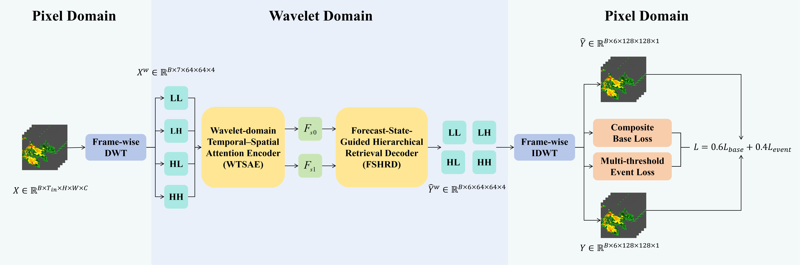

# HistCastNet

State-guided historical retrieval for short-term precipitation forecasting.

## Authors

- Rongli Gai (corresponding author, `gairongli@dlu.edu.cn`)
- Jinying Qiu

## Software information

- **Name:** HistCastNet
- **Language:** Python 3.9+
- **Hardware:** CUDA-capable GPU recommended; paper experiments used three NVIDIA RTX 4090 GPUs
- **Dependencies:** PyTorch, PyTorch Lightning, h5py, NumPy, pandas, SciPy, Matplotlib, OmegaConf, and TorchMetrics
- **Source size:** approximately 1.3 MB, excluding Git metadata
- **Data:** SEVIR VIL; data are not redistributed by this repository

HistCastNet forecasts six future VIL frames from seven observed frames at 10-minute intervals. It combines a one-level Haar wavelet representation, a Wavelet-domain Temporal-Spatial Attention Encoder (WTSAE), and a Forecast-State-Guided Hierarchical Retrieval Decoder (FSHRD). The training objective combines intensity-weighted reconstruction, neighborhood consistency, and multi-threshold event supervision.



## Highlights

- Preserves the complete observed temporal memory at two spatial scales.
- Retrieves lead-time-specific evidence using the evolving forecast state.
- Models temporal evolution per location and spatial interactions in local windows.
- Emphasizes sparse high-intensity VIL events with threshold-aware supervision.
- Predicts in the wavelet domain and reconstructs forecasts with an inverse Haar transform.

## Installation

Python 3.9 or newer is required. Install PyTorch for your CUDA version first, then install this project:

```bash
pip install -e .
```

## Data

The default configuration uses SEVIR-LR with 128 x 128 VIL frames. Put the fixed split files in:

```text
datasets/sevir_lr/interim/
|-- nowcast_train.h5
|-- nowcast_val.h5
`-- nowcast_test.h5
```

Each HDF5 file must contain `IN` and `OUT` datasets with shapes `(N, 128, 128, 7)` and `(N, 128, 128, 6)`. Values are expected in the raw VIL range 0-255 and are normalized during loading.

To keep data outside the repository, set:

```bash
export HISTCASTNET_DATA_DIR=/absolute/path/to/datasets
```

The resulting layout should still be `$HISTCASTNET_DATA_DIR/sevir_lr/interim/nowcast_*.h5`.

## Training

Single GPU:

```bash
python scripts/train_histcastnet.py \
  --cfg configs/histcastnet_sevirlr.yaml \
  --save histcastnet_sevirlr \
  --gpus 1
```

Three GPUs, matching the paper configuration:

```bash
python scripts/train_histcastnet.py \
  --cfg configs/histcastnet_sevirlr.yaml \
  --save histcastnet_sevirlr \
  --gpus 3
```

Outputs are written under `scripts/experiments/<save-name>/` and are ignored by Git.

## Evaluation

Evaluate a Lightning checkpoint stored in the selected experiment directory:

```bash
python scripts/train_histcastnet.py \
  --cfg configs/histcastnet_sevirlr.yaml \
  --save histcastnet_sevirlr \
  --gpus 1 \
  --test \
  --ckpt_name <checkpoint>.ckpt
```

Evaluate a standalone local PyTorch state dict:

```bash
python scripts/train_histcastnet.py \
  --cfg configs/histcastnet_sevirlr.yaml \
  --save histcastnet_sevirlr_eval \
  --gpus 1 \
  --pretrained \
  --ckpt_name /absolute/path/to/histcastnet_sevir.pt
```

## Repository layout

```text
configs/                    Training configuration
scripts/train_histcastnet.py Training and evaluation entry point
src/histcastnet/models/      HistCastNet, WTSAE, and FSHRD implementation
src/histcastnet/datasets/    SEVIR and SEVIR-LR loaders
src/histcastnet/metrics/     Nowcasting skill scores
```

## Citation

```bibtex
@misc{gai2026histcastnet,
  title={HistCastNet: A State-Guided Historical Retrieval Network for Short-Term Precipitation Forecasting},
  author={Gai, Rongli and Qiu, Jinying},
  year={2026}
}
```

## License

HistCastNet is licensed under the Apache License 2.0. See `LICENSE`.
